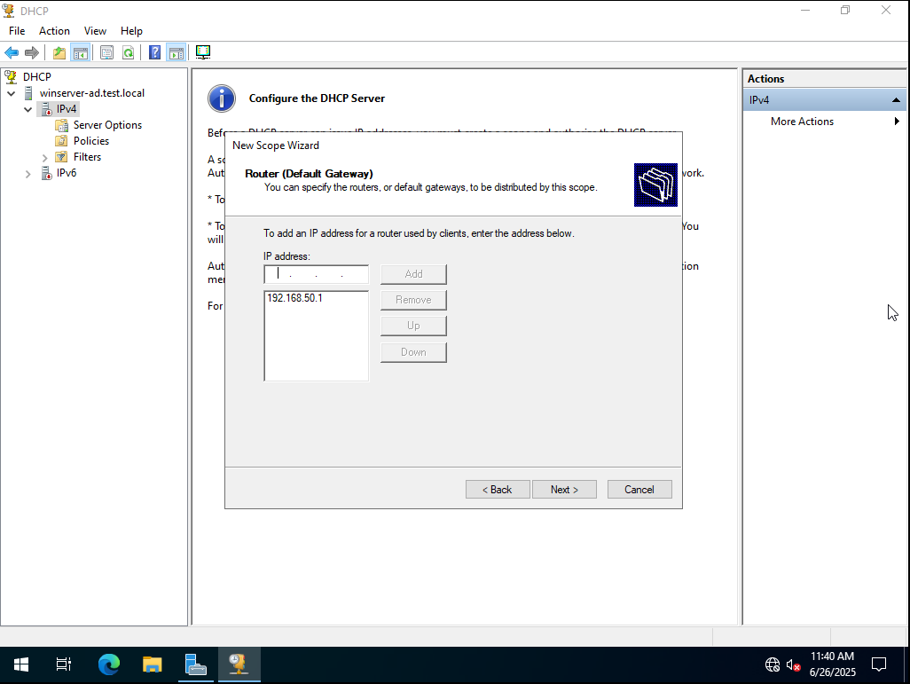

# DHCP Server Configuration Lab (Windows Server 2022)

This lab demonstrates the full process of configuring a DHCP server on Windows Server 2022 and testing automatic IP address assignment on a client machine.

---

## Environment

- **Server OS:** Windows Server 2022  
- **Client OS:** Windows 10 (domain-joined)  
- **Domain:** `test.local`  
- **IP Range:** `192.168.50.100 – 192.168.50.200`  
- **Default Gateway:** `192.168.50.1`  
- **DNS Server:** `192.168.50.1`

---

## Steps and Screenshots

| No. | Description                                                                 | Screenshot |
|-----|------------------------------------------------------------------------------|------------|
| 1   | DHCP role installed and visible in Server Manager                           |  |
| 2   | Server network adapter set to Internal network                              |  |
| 3   | Client network adapter set to Internal as well                              |  |
| 4   | Starting the New Scope Wizard                                               |  |
| 5   | Entering a name for the DHCP scope                                          |  |
| 6   | Specifying the IP address range for the scope                               |  |
| 7   | Setting the lease duration                                                  |  |
| 8   | Adding the default gateway                                                  |  |
| 9   | Specifying DNS server IP address                                            |  |
|10   | Scope successfully created and visible in DHCP console                      |  |
|11   | Client IPv4 settings set to obtain IP address automatically                 |  |
|12   | DHCP service is running on the server                                       |  |
|13   | Client successfully receives IP address from DHCP server                    |  |
|14   | DHCP server authorized in Active Directory                                  |  |
|15   | DHCP service restarted after successful authorization                       |  |
|16   | DHCP server now authorized and running properly                             |  |
|17   | Client confirmed to be configured for auto IP via DHCP                      |  |
|18   | Final confirmation of successful IP lease from server to client             |  |

---

## ✅ Result

DHCP server was successfully installed, configured, authorized in Active Directory, and tested with a client device.

---

## 💡 What I Learned

- How to install and configure the DHCP role on Windows Server 2022  
- How to create and configure a DHCP scope with custom IP range, gateway, and DNS  
- The process of authorizing a DHCP server in Active Directory  
- Troubleshooting client connectivity and verifying successful IP address lease  
- The importance of internal network setup for testing DHCP functionality in a virtualized environment  
- Using PowerShell and GUI tools together for administrative tasks

---

**📁 All screenshots are stored in the `/screenshots` folder.**
